#### **Reference**

Company information from ASX official website: [https://www.marketindex.com.au/asx20]()

#### **GitHub Repository Link**

[https://github.com/keithc07/ASX20-Simulator.git]()

#### Installation and run the app

1. Download Ruby from the following website:

   [https://www.ruby-lang.org/en/downloads/]()
   
2. Either **download** or **clone** the `ASX20-Simulator` file from the repo

   a. **Download**: In the repo page, click on `Code`. Then there is an option `Download ZIP` that allows you to download the file

   b. **Clone**: Using command lines to clone the repo.

   ```
   git clone https://github.com/keithc07/ASX20-Simulator.git
   ```

3. Once you have the file `ASX20-Simulator`, navigate to the file first:

   ```
   cd path/ASX20-Simulator
   ```
   
   Then navigate to `src`:
   
   ```
   cd src
   ```
   
4. Download the required gems using `bundler` with command lines:

   ```
   bundle install
   ```

   - If you haven't used`bundler` before, install`bundler` first:
     ```
     install bundler
     ```

5. Run the script `run_app` with the following command:

   ```
   ./run_app.sh
   ```

(No specific system/hardware requirements to run the app)

#### **Purpose and Scope**

The main purpose of this application "ASX20-Simulator" is allowing users to simulate the situation where they can create an investment portfolio with ASX20. Throughout the app, there are navigation panels to direct to different sections of the app. The app includes a list of ASX20 companies. Each of them has a brief description of itself, industry, and share price. The users can choose to buy or sell the shares, then it displays the updated available deposits and shares the users own. Another function includes viewing the portfolio status. There will be a pie-chart of shares allocation where it displays the company short name of the purchased shares, and the percentage of each company shares occupying total purchased company shares value. Apart from the pie-chart, the remaining deposit is shown. The last function is exit where users can leave the application via this option.

This application can solve the problem of users planning to invest in companies of ASX20. It provides a similar environment in investment in equity. The reason of developing this application is investment in equity has become an instrument of many people to manage their financial condition. Almost everyone participates in equity investment either directly or indirectly, and some of them may have minimal or zero experience in that. Hence, the development of this application is to provide basic knowledge to new investors or someone who is interested in investment transactions on a real platform. When they are engaged in real life share transactions, they can perform the least actions. Also, they can realise there are some additional features in relation to their investment on the trading platform.

New investors can employ this application to plan for the allocation of investing in ASX20 companies. The investors can use the application to have some understanding about the company and buy shares of it. In the meantime, the display of the allocation with a pie-chart allows them to quickly recognize the status or result of their investment allocation. They may find the pie-chart obvious and easy to read. Consequently, they can make changes according to the pie-chart and can refer to it at any time to confirm their current positions. Before the investors make a real decision, it can verify their investment strategies or planning. Since it does not involve any real money transaction, the investors can make changes at any time until they are satisfied with their portfolio. Then they can apply the similar strategies on real life investment transactions.

#### **List of Features**

|        Features        | Descriptions                                                 |
| :--------------------: | ------------------------------------------------------------ |
|      **Display**       | Title is displayed with a different font-style and enlarged using TTY-font. Add colors and text-feature to specific text or sentences with Rainbow. For example, names of the company, industries, and categories. Using TTY-table to contain company information. A pie-chart is generated with TTY-pie to reflect user investment allocation. If the users have no shares on hand, the display of pie-chart will incur an error and it is solved with rescue. |
|     **Navigation**     | Throughout the app, TTY-prompt is used to create navigation panel on each section that allows users to use either number or arrow keys with Enter to direct to different sections of the app. |
| **Gather Information** | The app collects users input of number of shares they buy or sell. The data are stored in an array of the company. When the users are asked to input the number of shares, the app will check whether the input is valid or not. For instance, it validates whether the user has enough deposits to buy or enough number of shares on hand to sell. If it is not validated, the app will tell the user to try again. Once it is successful, the number of shares will be added to or deducted from the array. Each company has its own array to identify which company the users are doing transactions on. |
|    **Calculation**     | After the user input the number of shares to buy or sell, the app will automatically calculate the total share values of the transaction. If the transaction is validated, it displays the value of the transaction with updated available deposits and shares own of that company. Also, the pie-chart involves the calculation of the occupation percentage of a company shares own among all company shares own in terms of value. |

#### **User Interaction and Experience**

###### Feature - Display

Users will realise this feature once the app is running. The feature is embedded in most of the text and some contents of the app.

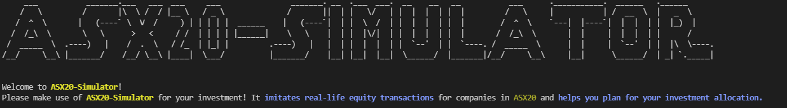

The display of pie-chart will incur an error if the users do not own any shares. It is solved by displaying a message to tell the users about the problems and here is the example:

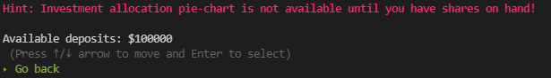

Once the users have at least 1 share on hand, the pie-chart is available:

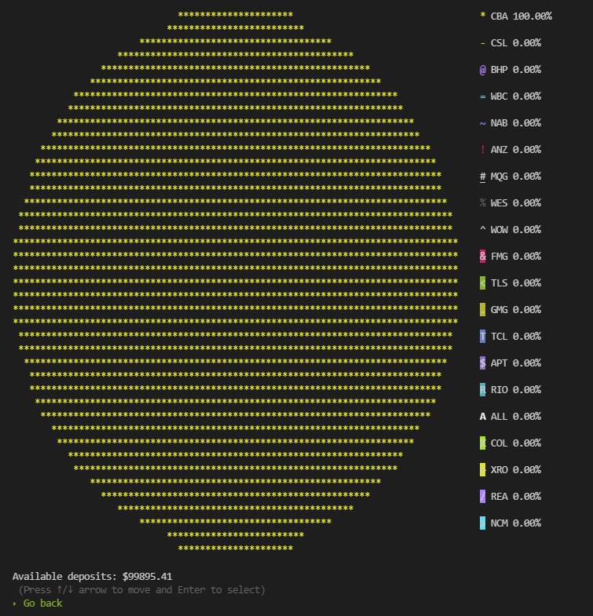

###### Feature - Navigation

The users can find out how to use this feature in every single section of the app. Whenever the users are directed to a section, there is an instruction to tell the users how to use it. Each choice will bring the users to the different sections of the app, and here are two forms of navigation style:

Use key arrows:

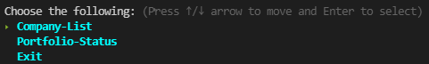

Input numbers:

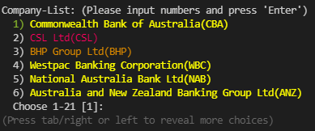

If the input number is not within the range, an error occurs and shows a message to require the users to re-enter a valid input.

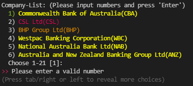

###### Feature - Gather Information

The users can do share transactions in either buy or sell shares section of a company. In each of the section, there is a message displayed to require the users to input the number of shares to buy or sell.

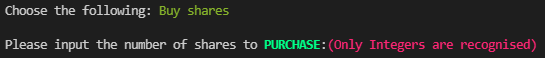

###### Feature - Calculation

The users will know how much they have used for buying shares or received from selling shares after inputting a valid number of shares. Also, it displays the remaining amount that the users own.

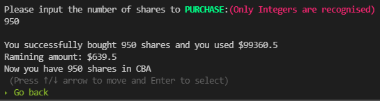

If the users input invalid number of shares, the app will calculate the invalid input and show the results. Then it requires the users to input again as shown in the following:

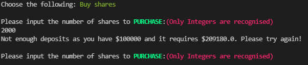

#### Testing Application

| Test                                                         | Details                                                      | Procedure and expected result                                |
| ------------------------------------------------------------ | ------------------------------------------------------------ | ------------------------------------------------------------ |
| Input invalid number of shares in buy or sell section (Feature - Calculation) | Test whether the app can run properly without going into an error which forces the app to stop. | Case 1) Navigate to Company-List > Commonwealth Bank of Australia(CBA) > Buy shares section. Input 5000 for the number of shares to purchase. The expected result is the app can run properly and require the user to input again. <br />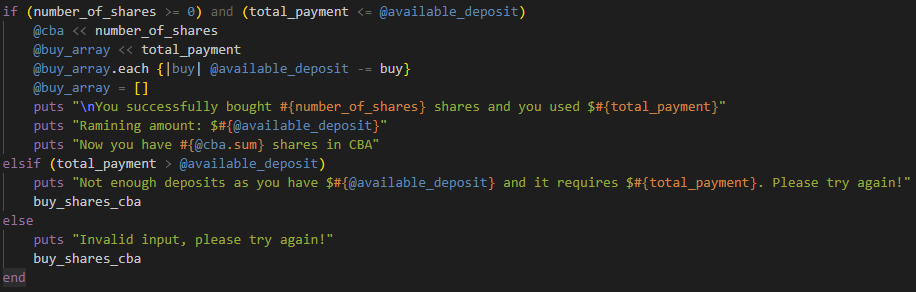<br />Case 2) Navigate to Company-List > Commonwealth Bank of Australia(CBA) > Sell shares section. Input -1000 for the number of shares to sell. The expected result is the app can run properly and require the user to input again.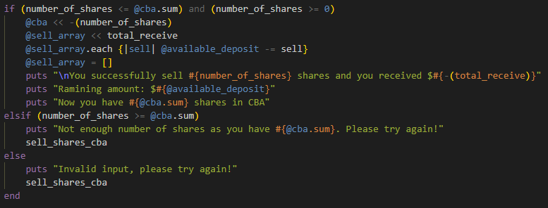 |
| Not buying any shares and buy all 20 companies shares (Feature - Display) | Test whether the pie-chart in Portfolio-Status section displays properly and to see if the app will run into an error and stop or not | Case 1) Not buying any shares and navigate to Portfolio-Status section. The expected result is there is no pie-chart to display and a message pops up.<br />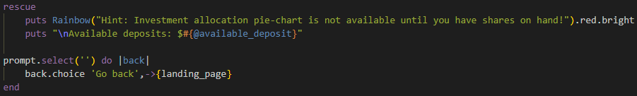<br />Case 2) Buy shares from 20 companies. Confirm there is at least 1 share on hand for each company and navigate to Portfolio-Status section. The expected result is the pie-chart will display all 20 companies shares.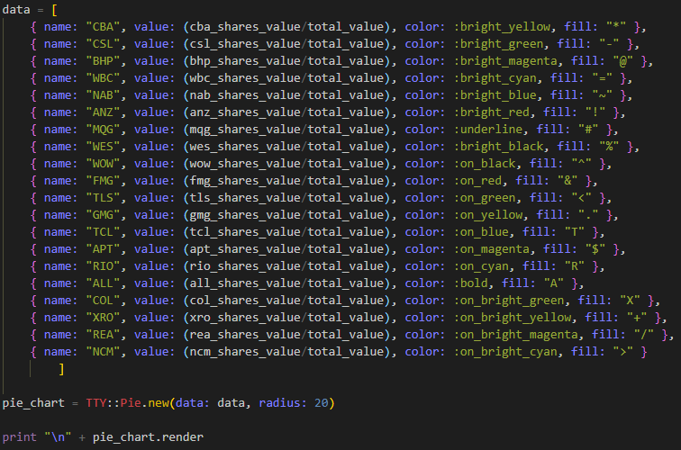 |


#### **Control Flow Diagram**


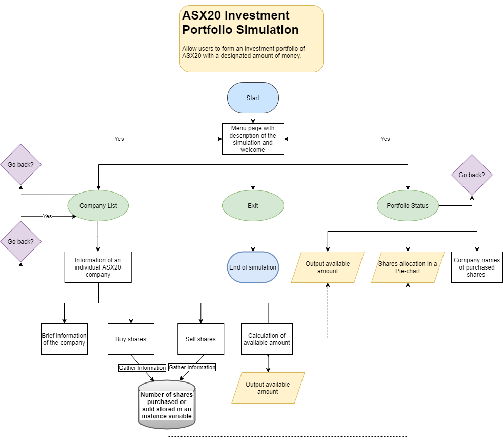

#### **Implementation Plan**

Day 1:

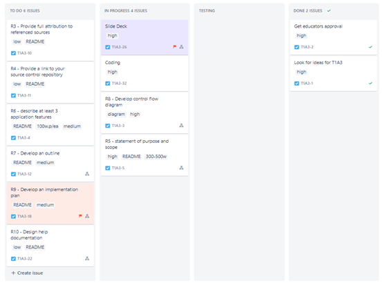

Day 2:


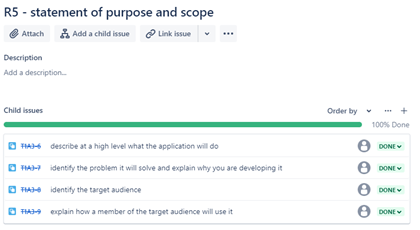

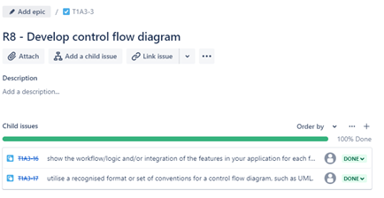

Day 3:

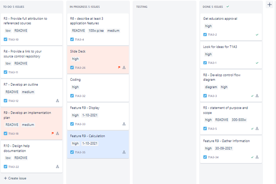

Day 4:

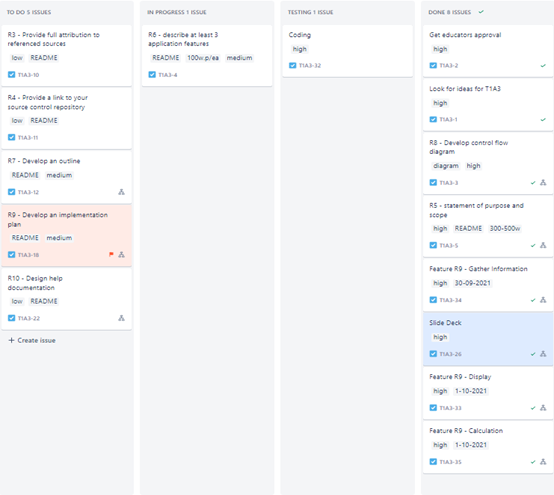

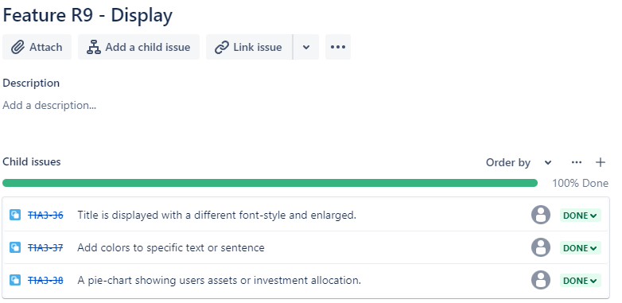


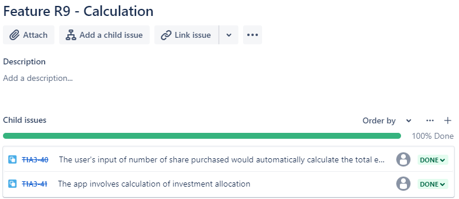

Day 7:

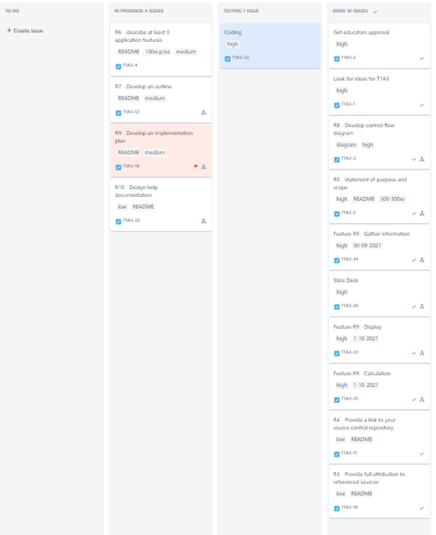

Day 9:

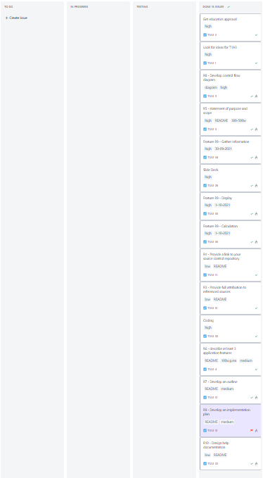


